# 2D Top-Down Action Game

A wave-based 2D action game built with LibGDX framework for Android, featuring spatial audio, visual effects, and engaging combat mechanics.

---

## Game Assets Preview

### Player Character (8-Directional Animation)
| Idle | Walking | Shooting |
|:----:|:-------:|:--------:|
| 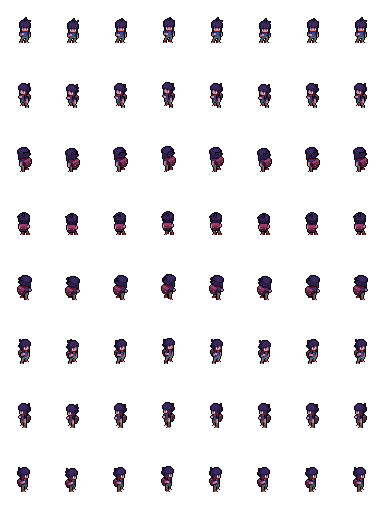 | 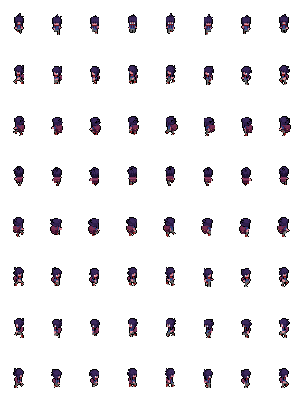 | 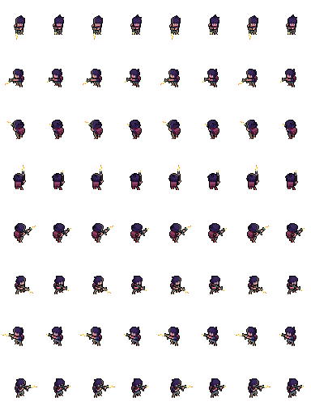 |

### Enemy Character
| Idle | Walking | Attack |
|:----:|:-------:|:------:|
| 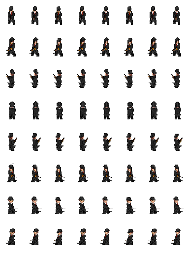 | 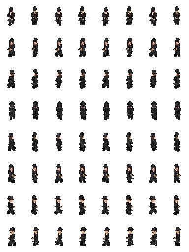 | 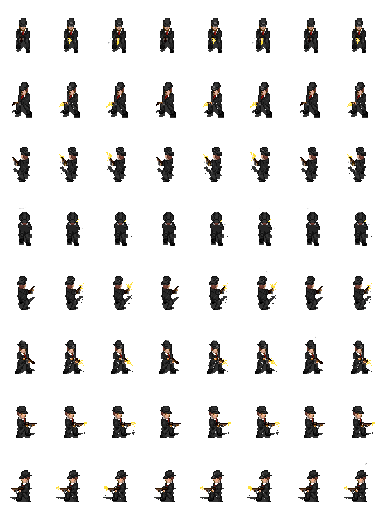 |

### Weapons & Items
| Bullet | Spear Attack | Blood Effect |
|:------:|:------------:|:------------:|
|  | 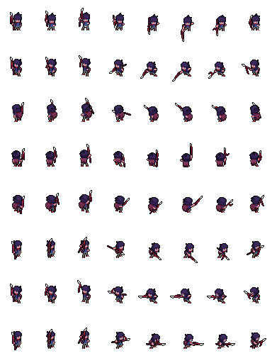 |  |

### Environment
| Tileset | Car |
|:-------:|:---:|
| 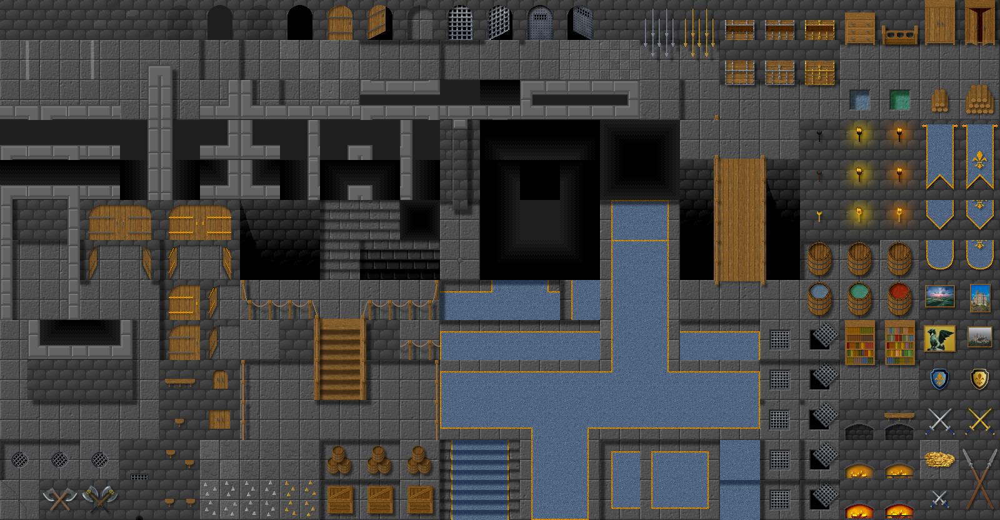 |  |

---

## Screenshots

### Main Menu
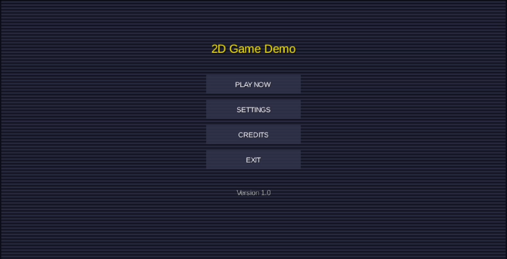

### Gameplay & Combat
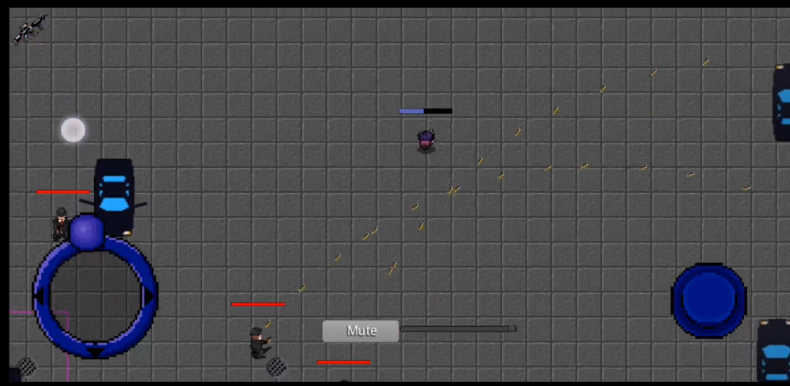

### Weapon Selection (Pie Menu)
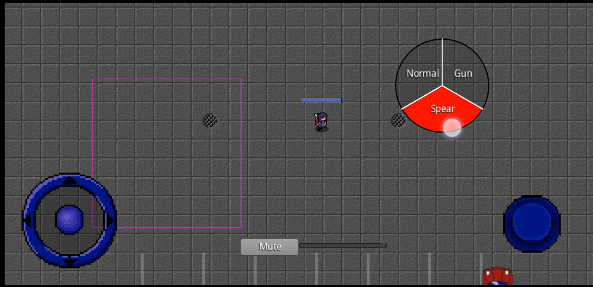 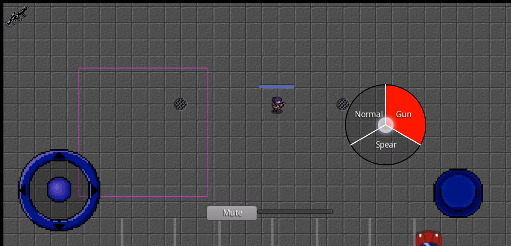

### Cutscene & Dialog


### Mission Complete
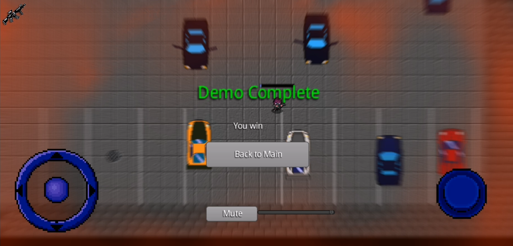

### Game Over Screen
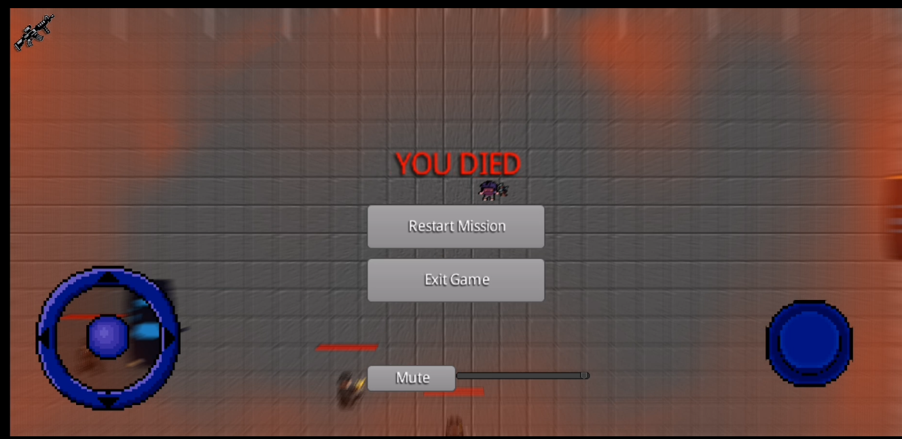

---

## Overview

This project is a 2D top-down action game developed for Android devices using the LibGDX framework. The player navigates through a tiled map environment while combating waves of enemies using various weapons including melee and ranged options.

---

## Features

### Core Gameplay
- **Wave-based Combat System**: 7 progressive waves with increasing difficulty (22 total enemies)
- **Multiple Weapons**: Three weapon types (Unarmed, Spear, Gun) with unique attack mechanics
- **8-Directional Movement**: Smooth character movement with directional sprite animations
- **Enemy AI**: Intelligent enemies with line-of-sight detection, pathfinding, and attack behaviors
- **Character Selection**: Choose between male and female character sprites

### Technical Features
- **Box2D Physics**: Zero-gravity physics for top-down movement and collision detection
- **Spatial Audio**: 3D positional audio using gdx-sfx library for immersive sound effects
- **Visual Effects**: Post-processing effects including radial blur using gdx-vfx
- **Object Pooling**: Efficient bullet management using LibGDX's Pool class
- **Tiled Map Integration**: TMX map support for level design with collision layers
- **Particle Effects**: Blood splatter effects with customizable emitters
- **Fixed Timestep**: Consistent physics updates at 1/60th second with accumulator pattern

### UI/UX
- **Virtual Joystick**: Touch-based movement control
- **PieMenu Weapon Selection**: Radial menu for quick weapon switching
- **Cutscene System**: Intro and outro sequences with animated characters and typewriter text
- **Main Menu**: Settings for audio volume and character gender selection

---

## Technology Stack

| Component | Technology |
|-----------|------------|
| Framework | LibGDX 1.12.1 |
| Physics | Box2D |
| Build System | Gradle (Kotlin DSL) |
| Language | Java 8 |
| Target Platform | Android (API 28+) |
| IDE | Android Studio |

### External Libraries
| Library | Version | Purpose | Repository |
|---------|---------|---------|------------|
| LibGDX | 1.12.1 | Game framework | [libgdx/libgdx](https://github.com/libgdx/libgdx) |
| gdx-sfx | 3.0.0 | Spatial/3D positional audio | [spookygames/gdx-sfx](https://github.com/spookygames/gdx-sfx) |
| gdx-vfx | 0.5.4 | Post-processing visual effects | [crashinvaders/gdx-vfx](https://github.com/crashinvaders/gdx-vfx) |
| PieMenu | 5.0.0 | Radial menu UI component | [payne911/PieMenu](https://github.com/payne911/PieMenu) |
| Box2D | 1.12.1 | 2D physics engine | [libgdx/libgdx](https://github.com/libgdx/libgdx/wiki/Box2d) |

---

## Project Structure

```
GameEngine/
├── app/
│   ├── src/main/java/com/sotiris/engine/
│   │   ├── Demo.java                    # Main game screen & game loop
│   │   ├── MainMenu.java                # Menu system with settings
│   │   ├── MainActivity.java            # Android entry point
│   │   ├── AndroidLauncher.java         # LibGDX launcher
│   │   ├── GdxInitializer.java          # Native library loader
│   │   │
│   │   ├── entities/
│   │   │   ├── Player.java              # Player character (FSM, animations, combat)
│   │   │   ├── Enemy.java               # Enemy AI (chase, attack, death)
│   │   │   ├── Bullet.java              # Projectile entity
│   │   │   ├── BulletPool.java          # Object pooling for bullets
│   │   │   └── Car.java                 # Animated car with physics
│   │   │
│   │   ├── ui/
│   │   │   ├── Joystick.java            # Virtual joystick touch control
│   │   │   ├── PieMenuManager.java      # Radial weapon selection menu
│   │   │   └── GameUIBuilder.java       # UI screen builder (GameOver, Settings, etc.)
│   │   │
│   │   └── utils/
│   │       ├── CollisionManager.java    # Tiled map collision handling
│   │       ├── CutsceneCharacter.java   # Cutscene NPC with dialog
│   │       ├── CutsceneManager.java     # Cutscene orchestration & camera control
│   │       ├── WaveManager.java         # Enemy wave spawning & car arrivals
│   │       ├── MoveBodyAction.java      # Custom LibGDX action for physics
│   │       └── MySpatializedSoundPlayer.java  # Extended spatial audio
│   │
│   └── src/main/assets/
│       ├── maps/                        # Tiled TMX maps & tileset
│       ├── male/                        # Male character sprites (8 directions)
│       ├── female/                      # Female character sprites (8 directions)
│       ├── enemy/                       # Enemy sprites & animations
│       ├── cars/                        # Vehicle sprites
│       ├── sounds/                      # Audio files (SFX & music)
│       └── skin/                        # UI skin assets
│
├── build.gradle.kts                     # Root build configuration
└── app/build.gradle.kts                 # App dependencies & config
```

---

## Architecture

### Design Patterns Used
| Pattern | Implementation |
|---------|----------------|
| **Finite State Machine** | Player and Enemy states (IDLE, WALK, ATTACK, DEATH) |
| **Object Pool** | BulletPool for efficient projectile management |
| **Observer/Callback** | WaveManager, CutsceneManager, GameUIBuilder callbacks |
| **Actor Pattern** | All entities extend LibGDX Scene2D Actor class |
| **Manager Pattern** | WaveManager, CutsceneManager for separation of concerns |
| **Builder Pattern** | GameUIBuilder for UI screen construction |

### Game Loop Architecture
```
┌─────────────────────────────────────────────────┐
│                    render()                      │
├─────────────────────────────────────────────────┤
│  1. Accumulator += deltaTime                     │
│  2. While (accumulator >= FIXED_TIMESTEP):       │
│     ├── Update physics (Box2D step)              │
│     ├── Update entity states                     │
│     └── accumulator -= FIXED_TIMESTEP            │
│  3. Render map layers                            │
│  4. Render entities (Stage.draw())               │
│  5. Render UI overlay                            │
│  6. Apply post-processing effects (VFX)          │
└─────────────────────────────────────────────────┘
```

### Entity State Machines

**Player States:**
```
IDLE ←→ WALK ←→ RUN
  ↓       ↓       ↓
SHOOTING / ATTACK_SPEAR
  ↓
DEATH (terminal)
```

**Enemy States:**
```
IDLE → WALK (chase player) → ATTACK
                ↓
              DEATH (terminal)
```

---

## Building and Running

### Prerequisites
- Android Studio Arctic Fox or later
- Android SDK 34
- Java Development Kit 8+

### Build Steps

1. Clone the repository:
```bash
gh repo clone Radeon80s/2D-Action-Game-FYP
```

2. Open the project in Android Studio

3. Sync Gradle files

4. Build and run on an Android device or emulator (API 28+)

### Build Commands
```bash
# Debug build
./gradlew assembleDebug

# Release build
./gradlew assembleRelease

# Clean build
./gradlew clean assembleDebug
```

---

## Gameplay

### Controls
| Control | Action |
|---------|--------|
| Left Joystick | Move character in 8 directions |
| Fire Button | Attack with current weapon |
| Long Press (Right) | Open weapon selection wheel |
| Tap on Dialog | Advance/skip cutscene text |

### Weapons
| Weapon | Damage | Range | Fire Rate | Description |
|--------|--------|-------|-----------|-------------|
| Unarmed | - | - | - | No attack capability |
| Spear | 100 | Melee | Slow | High damage single strike |
| Gun | 20 | Ranged | Fast | Rapid-fire projectiles |

### Wave System
| Wave | Enemies | Notes |
|------|---------|-------|
| 1 | 5 | Introduction wave |
| 2 | 4 | Standard enemies |
| 3 | 1 | Mini-boss encounter |
| 4 | 2 | Brief respite |
| 5 | 1 | Mini-boss encounter |
| 6 | 4 | Escalation |
| 7 | 5 | Final wave |

**Total: 22 enemies across 7 waves**

---

## Configuration

### Player Settings (`Player.java`)
```java
private static final float MAX_SPEED = 200f;
private static final int INITIAL_HEALTH = 1000;
private static final int SPEAR_DAMAGE = 100;
private static final int BULLET_DAMAGE = 20;
private static final float BULLET_SPEED = 1000f;
private static final float SHOOT_COOLDOWN = 0.1f;
```

### Enemy Settings (`Enemy.java`)
```java
private static final float MAX_SPEED = 200f;
private static final int INITIAL_HEALTH = 120;
private static final float ATTACK_RANGE = 280f;
private static final float CHASE_RANGE = 600f;
```

### Physics Settings (`Demo.java`)
```java
private static final float TIME_STEP = 1/60f;
private static final int VELOCITY_ITERATIONS = 8;
private static final int POSITION_ITERATIONS = 3;
```

---

## Acknowledgments

### Libraries & Frameworks
- [LibGDX](https://github.com/libgdx/libgdx) - Cross-platform game development framework
- [gdx-sfx](https://github.com/spookygames/gdx-sfx) - Spatialized sound effects for LibGDX
- [gdx-vfx](https://github.com/crashinvaders/gdx-vfx) - Post-processing shader effects
- [PieMenu](https://github.com/payne911/PieMenu) - Radial menu widget for Scene2D

### Assets
- **Player Sprites**: [sscary](https://sscary.itch.io/) - [The Adventurer Male](https://sscary.itch.io/the-adventurer-male) & [The Adventurer Female](https://sscary.itch.io/the-adventurer-female) (Premium, purchased)
- **Enemy Sprites**: [Game Gland](https://gamegland.itch.io/) - [Zombie Apocalypse Character Spritesheet](https://gamegland.itch.io/zombie-apocalypse-character-spritesheet)
- **Tileset**: Gary Shaw - [Castle/Dungeon Tileset](https://opengameart.org/content/castle-dungeon) (CC-BY 4.0)
- **Vehicles**: Lowder2 - [Vary Car Pack 1](https://opengameart.org/content/vary-car-pack-1)
- **Map Design**: Created using [Tiled Map Editor](https://www.mapeditor.org/)

---

## Author

**Sotiris Konstantinou**

University of Nicosia
Final Year Project - 2025/2026

---

## License

This project is submitted as part of an academic Final Year Project.
